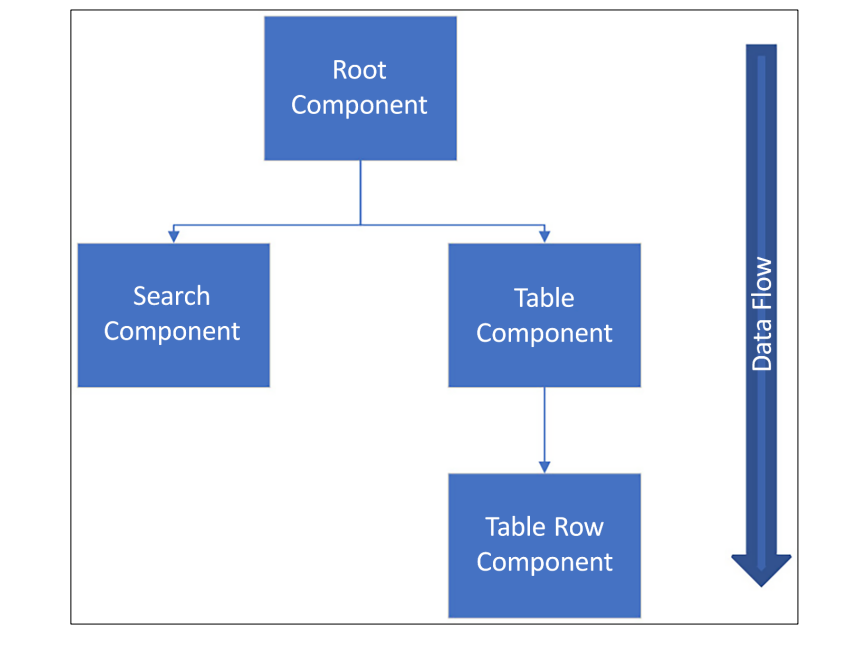

# 📂 03.03 수업 내용  
# 📍 안내사항
1. cardatabase3를 기준으로 한다.
    - JWT Authentication 까지 적용된 부분

2. React 자체 관련 수업들을 진행하기 위해서 CarDatabase 연결 전 이론 및 실습이 있을 예정

# 🟪 VS code react extension 설정
1. ESLint
    - JavaScript용 오픈 소스 린터로, 소스 코드에서 문제를 찾아 수정하는 것을 도와준다.
2. Reactjs code snippets
    - 단축어 지원
    
# 🟪 React 앱 만들기 및 실행
vite project를 사용한다. Next.js나 Remix와 같은 다른 리액트 프레임워크가 존재하지만, 기초 학습용으로 사용할 예정이다.
예전에는 CRA(Create React App)을 가장 많이 이용했으나 현재 이용률도 감소하고, React19에서는 공식적으로 지원이 중단되었다.

## 🟣 React 앱 만들기 process
1. vs code 상에서 터미널 열기
2. npm 명령어 사용  (node.js 설치 필요. `node -v`` `npm -v` 확인)
- `npm create vite@4.4`
- y 눌러서 ok to process
- 수업 기준으로 framework 선택하는 부분 : React
- variant 선택 부분 : JavaScript (추후 TypeScript 적용 예정)
- 나타나는 리눅스 명령어 실행
    - `cd 프로젝트명` : 해당 프로젝트로 이동
    - `npm install` : SpringBoot 상에서 build.gradle에 있는 의존성 목록이 있는 것처럼 react 프로젝트에는 package.json에 의존성 목록들이 존재한다. 그것들을 설치해야 프로젝트 실행이 가능하다.
    - `npm run dev` : 실행시키기 위한 명령어 (커스텀 가능)

## 🟣 React 앱 debugging하기
1. chrome -> react developer tools 검색 후 chrome 웹스토어 설치
2. react project 상에서 f12를 통해 개발자 모드를 진입하면 console 있는 부분 맨 끝에 Components라는 부분이 생긴다. 이는 리액트 컴포넌트 트리가 시각적으로 표현되며, 검색창을 이용해서 특정 컴포넌트를 검색하는 것이 가능하다.
3. Console 파트에서 JS 코드의 메시지, 경고, 오류를 확인할 수 있다.
4. Network 파트에서는 SpringBoot에서 봤던 401 / 404 / 500 등의 요청 및 응답을 확인할 수 있다.

# 🟪 Starting React

## 🟣 React Component 만드는 법
리액트는 UI를 위한 JS 라이브러리에 해당한다. 15버전 이후부터는 MIT 라이선스에 따라 개발되는 중이다. 리액트는 독립적이고 재사용이 가능한 컴포넌트를 기반으로 작동하는 프레임워크이다.




이상의 구조를 바탕으로 설명한다.

현재 이미지에서 root 컴포넌트에는 검색 컴포넌트와 표 컴포넌트라는 두 개의 하위 컴포넌트가 존재한다. 그리고 표 컴포넌트에는 표-행 컴포넌트라는 하위 컴포넌트 하나가 존재한다. 리액트에서 이해해야 할 중요한 점은 **데이터의 흐름이 상위 컴포넌트에서 하위 컴포넌트로 일방향 이동한다는 점**이다.
Props를 통해 상위 컴포넌트에서 하위 컴포넌트로 데이터를 전달하는 방법을 학습할 예정.

- React는 UI를 선택적으로 다시 렌더링하기 위해서 VDOM(Virtual Document Object Model)을 이용한다. 이는 DOM이 웹페이지의 구조화된 객체 트리 구조로 표현하는 웹 문서용 프로그래밍 인터페이스를 의미하고, 각 트리의 객체는 문서의 일부에 해당한다. (그래서 .html 파일들을 보면 들여쓰기가 되어있다.) 개발자들은 DOM을 이용하여 문서를 만들고, 구조를 탐색하고, element와 컨텐츠를 추가, 수정, 삭제하는 것이 가능했다. (todolist 참고) 그런데 VDOM은 경량화된 DOM에 해당하는데, 매번 전체 정보를 다 불러오는 DOM과 달리 VDOM의 경우 값이 바뀐 부분만 들고 온다는 차이점이 존재한다. VDOM이 업데이트된 후 리액트는 업데이트가 실행되기 전의 VDOM의 스냅샷과 비교한 후, 변경된 부분만 실제 DOM에 업데이트하는 과정을 거치게 된다.

- React 컴포넌트는 함수 컴포넌트인 JS 함수 또는 클래스 컴포넌트인 ES6 JS 클래스를 통해 정의할 수 있다.

Hello World 텍스트를 렌더링하는 코드의 예시
```jsx
function App() {
    return <h1>Hello World !</h1>
}
```
- React 컴포넌트는 return이 필수이다.

그리고 ES6의 클래스를 이용하여 컴포넌트를 생성하는 방법도 있다.
```jsx
class App extends React.Component {
    render() {
        return <h1>Hello World !</h1>
    }
}
```

첫 번째 코드블록을 함수 컴포넌트 / 두 번째를 클래스 컴포넌트라는 표현을 사용한다. (기본적으로 함수 컴포넌트를 사용할 예정)

📌 참고사항 1 : 일반적인 JS 함수와의 차이를 두기 위해 React 컴포넌트는 파스칼케이스로 명명하는 것이 좋다.

📌 참고사항 2 : 
```jsx
export default function App() {
    return (
      <h1>Hello World !</h1>
      <h2>This is my First Component</h2>
    )
}
```
C:\jungmyeongwon\korit_12_react\myapp\src\App.jsx: Adjacent JSX elements must be wrapped in an enclosing tag. Did you want a JSX fragment <>...</>? (4:6)

- 만약 컴포넌트가 다수의 html 태그 요소를 return 한다면 하나의 상위 요소 안에 넣어줘야 한다. 
```jsx
export default function App() {
    return (
      <div>
        <h1>Hello World !</h1>
        <h2>This is my First Component</h2>
      </div>
    )
```
예전에는 이렇게 작성하였다.

- `<> </>` 사용 예시
```jsx
export default function App() {
    return (
    <>
      <h1>Hello World !</h1>
      <h2>This is my First Component</h2>
    </>
    )
}
```

## 🟣 JS review
### 상수 vs 변수
1. 상수 : const 선언자를 통해서 사용. 값 재할당 불가능.
2. 변수 : let 선언자를 통해서 사용. 값 재할당 가능.

- const는 블록 범위로 제한된다. 즉, const는 해당 변수가 정의된 블록 내에서만 이용이 가능하다. (지역 변수의 일종)
```jsx
let count = 10;
if (count 5 >) {
    const total = count * 2;
    console.log(total);     // 20이 출력
}
console.log(total);     // 오류가 발생
```
- const가 객체 또는 배열일 때 어떻게 되는지에 대한 예시
```jsx
const myObj = {id: 3};      // 자료형 JS 객체
myObj.id = 4;       // 가능하다
```
- 이상의 경우에서 const는 상수인데 어떻게 id 값을 변경할 수 있는지에 대한 의문이 생길 수 있다.
- myObj는 const이지만 myObj.id가 const이지는 않다.

### Template Literal
- 일반적으로 문자열을 연결하는 예시
```jsx
let person = {
    firstName : 'Jone',
    lastName : 'Doe'
}

let greeting = 'Hello ' + person.firstName + ' ' + person.lastName;
```

- 템플릿 리터럴 적용 예시 백틱(`) 사용
```jsx
let person = {
    firstName : 'Jone',
    lastName : 'Doe'
}

let greeting = `Hello $(person.firstName) $(person.lastName)`;
```

###  객체 구조 분해
객체 구조 분해를 이용하면 객체에서 값을 추출하여 변수에 할당할 수 있다. 단일 구문을 이용하여 객체의 여러 속성을 개별 변수에 할당하는 것도 가능하다. 

- 기본적인 예시
```jsx
let person = {
    firstName : 'Jone',
    lastName : 'Doe',
    email : 'j.doe@test.com'
}
```
Jone이라고 하는 string 데이터를 가지고 오고 싶다면 기본적으로는
```jsx
let firstName = person.firstName;
```
그런데 properties가 늘어나면 늘어날 수록 힘들다. 그래서 객체 구조 분해가 등장하게 되었는데,
```jsx
const { firstName, lastName, email } = person;
```
이상의 의미는 _처음으로_ firstName, lastName, email이라고 하는 세 개의 변수를 선언하고, 그 값을 person 객체의 동일한 key를 가지고 있는 곳에서 value를 가져와서 대입한다는 의미가 된다.

### 클래스 / 상속
- ES6의 클래스 정의는 Java와 C#같은 다른 객체 지향 언어들과 유사하다.
```jsx
class Person {
    constructor(firstName, lastName) {
        this.firstName = firstName;
        this.lastName = lastName;
    }
}
```
이상의 코드 예시에서는 클래스 정의 방법과 AllArgsConstructor를 정의하는 방법과 field 선언하는 방법을 작성했다. 그리고 method도 있을 수 있지만 생략했다.

```jsx
class Employee extends Person {
    constructor(firstName, lastName, title, salary) {
        super(firstName, lastName);
        this.title = title;
        this.salary = salary;
    }
}
```
그렇다면 Java / python과 유사점과 차이점을 알 수 있는데,

super()의 경우에는 Java와 완전히 일치하는 것을 확인할 수 있다. 

생성자의 매개변수 내에 자료형이나 선언자가 없다는 점은 python과 일치한다.

### Arrow Function
- 일반적인 함수를 정의하는 방법은 function 키워드를 사용하는 것이다. 그런데 Component 작성 시에도 사용하기 때문에 이 방식도 알아두어야한다.

```jsx
function(x) {return x * 2;}
```
이것을 화살표 함수로 작성하면
```jsx
x => x * 2;
```
이렇게 작성한다.

이는 익명 함수의 일종으로, 이 함수 자체를 호출할 수가 없다. (함수명이 없기 때문에) 하지만 이 익명 함수의 사용처는 주로 다른 함수의 argument로 기능한다. 그리고 let 선언자 이후에 함수를 변수명에 저장할 수 있었다는 점과 함치게 되면 원래는 호출이 불가능했던 익명 함수의 호출이 가능해진다.

```jsx
const calc = x => x * 2;
```
이상의 경우가 arrow function을 calc라고 하는 상수명에 대입하는 예시가 된다. 이 경우 함수를 이하와 같은 방식으로 호출하는 것이 가능해진다.
```jsx
calc(5);     // 10이 return
```
- 매개변수가 둘 이상인 경우에는 소괄호를 사용해야 한다.
```jsx
const calcSum = (x, y) => x + y;

// 함수 호출
calcSum(2, 3);      // 5가 return
```
- 함수 본문이 표현식인 경우 return을 명시할 필요가 없다. 하지만 함수 구현부가 여러 줄에 해당하는 경우에는 { }와 return이 명시되어야한다.
```jsx
const calcSum = (x, y) => {
    console.log("결과를 계산중입니다.");
    return x + y;
}
```
    - 한 줄 인데 { } 사용하면 무조건 return이 있어야 한다.
    - { } 사용하지 않고 두 줄 이상이면 오류가 발생한다.
    - 이상의 두 가지 사항을 다 합쳤을 때 (한 줄인데 { } 없고, return을 요구하는 표현식인 경우) return을 사용하지 않아도 된다. 하나라도 빠질 경우 { }와 return이 요구된다.

- 매개변수가 없다면 비어있는 ()가 요구된다.
```jsx
const sayHello = () => 'Hello !';

console.log(`$(sayHello) Jone !`);
```

## 🟣 JSX와 스타일링
- JSX는 JavaScript XML의 축약어이다. (XML은 Extended Markup Language) 이 개념에서 제일 자주 쓰이고 중요한 것은 { }를 사용하여 JS 표현식을 JSX에 표현할 수 있다는 점인데, 추후 예시를 통해 알아본다.

이하의 예제는 JSX로 컴포넌트의 프롭에 접근하는 방법이다.
```jsx
function App(props) {
    return <h1>Hello World {props.user}</h1>
}
```
여기에 JS 표현식도 전달이 가능하다.
```jsx
<Hello count={2+2} />
```

JSX 요소에는 inline 스타일링과 외부 스타일링 방식이 다 가능하다.
```jsx
<div style={{ height: 20, width: 200 }}>
    Hello
</div>
```

```jsx
const divStyle = { 
    color: 'red',
    height: 30
};
const MyComponent = () => {
    <div style={divStyle}>Hello again</div>
}
```

### props / state
props와 state는 컴포넌트를 렌더링하기 위한 입력 데이터에 해당한다. props나 state가 변경되면 컴포넌트가 다시 렌더링된다.

1. props(프롭)
    - 컴포넌트에 대한 입력이며, 상위 컴포넌트에서 하위 컴포넌트로 데이터를 전달하는 매커니즘에 해당한다. props의 자료형은 JS 객체이다. 그 말은 key-value properties로 이루어져 있다. 그렇기 때문에 여러 개의 key-valud pair를 보내는 것이 가능하다.
    - props는 불변이므로 컴포넌트는 props를 변경하는 것이 불가능하다. 그리고 그 props 개념은 상위 컴포넌트로부터 받고, 컴포넌트는 함수 컴포넌트에 매개변수로 전달되는 props 객체를 통해 전달이 가능하다.
```jsx
// Hello.jsx
function Hello() {
    return <h1>Hello 김일</h1>
}
```
이라고 가정한다.

```jsx
// main.jsx
import React from 'react'
import ReactDOM from 'react-dom/client'
import App from './App.jsx'
import Hello from './Hello.jsx'
// import './index.css'

ReactDOM.createRoot(document.getElementById('root')).render(
  <React.StrictMode>
    <App />
    <Hello />
  </React.StrictMode>,
)
```
이상의 코드는 Hello 김일 이라는 정적 메시지를 렌더링할 뿐이며 재사용할 수가 없다. 하드코딩된 이름(김일)을 이용하는 대신에 props를 활용하면 Hello 컴포넌트에 이름을 전달하는 것이 가능하다.
```jsx
// main.jsx
import React from 'react'
import ReactDOM from 'react-dom/client'
import Hello from './Hello.jsx'

ReactDOM.createRoot(document.getElementById('root')).render(
  <React.StrictMode>
    <Hello user='김일'/>
    <Hello user='최일'/>
    <Hello user='김이'/>
  </React.StrictMode>,
)
```
- 이전에는 main을 수정했지만 기본적으로는 App.jsx를 가장 상위로 두고, main.jsx에는 App 컴포넌트만 존재하는게 이상적이다.
```jsx
import Hello from "./Hello";

export default function App() {
  return(
    <>
      <Hello user='김영'/>
      <Hello user='김일'/>
      <Hello user='김이'/>
    </>
  );
}
```
- props로 2개 받아오기
```jsx
// Hello.jsx
export default function Hello(props) {
  return <h1>Hello {props.firstName} {props.lastName}</h1>
}

// main.jsx
import Hello from "./Hello";

export default function App() {
  return(
    <>
      <Hello firstName='Jone' lastName='Doe'/>
      <Hello firstName='길동' lastName='홍'/>
      <Hello firstName='영' lastName='김'/>
    </>
  );
}
```
- 이상의 코드에서 고려할 점은 props가 JS 객체라고 했기 때문에 key를 개발자 마음대로 정의할 수 있다. 그리고, properties의 수도 마음대로 정할 수 있다. 즉, App 컴포넌트가 렌더링 될 때 정해진 firstName / lastName의 key의 value를 Hello 컴포넌트가 받아서 return으로 _렌더링_ 했다고 볼 수 있다.

이하에서는 객체 구조 분해를 도입한 방식으로 작성한다.
```jsx
// Hello.jsx
export default function Hello({firstName, lastName}) {
  return <h1>Hello {firstName} {lastName}</h1>
}
```
- 이상의 코드는 예악어인 props 대신에 Hello 컴포넌트의 매개변수로 애초에 destructuring된 (객체 구조분해된) 변수들이 firstName, lastName을 집어넣었다. 그 말은 props 내에 있는 key-value properties가 fistName / lastName이라는 key를 가지고 있다는 뜻이 되는데, 그렇기 때문에 `키이름` 만으로 value를 불러오는 것이 가능하게 된다. props를 반복해서 쓰기 싫은 경우에 구조분해를 적극적으로 도입해볼만 하겠다.

2. state
- 리액트에서 컴포넌트의 _상태_ 는 시간의 변화에 따라 변경될 수 있는 정보를 보관하는 내부 데이터 저장소를 의미한다. 그리고 이 상태는 컴포넌트의 렌더링에도 영향을 준다. 상태의 값이 바뀌게 되면 리액트는 그 상태가 포함되어있는 컴포넌트를 리렌더링하게 된다. 그렇다면 상태는 최신값을 유지하게 되겠다. 이 개념은 컴포넌트가 사용자 상호작용이나 기타 이벤트에 동적으로 반응할 수 있도록 해준다.

📌 참조 : 일반적으로 액트 컴포넌트에 불필요한 상태를 도입하지 않는 편이 좋다. 복잡성이 증가하고 부작용이 일어날 수 있기 때문이다. 그런 경우에는 상태가 아니라 let을 통한 변수의 도입이 더 나을 수 있다. 근데 변수의 값 변경은 리렌더링이 일어나지 않는다는 점을 명심할 필요가 있다.

- 상태의 값이 변경되면 리렌더링이 일어난다.
- 변수의 값이 변경되는 것은 리렌더링이 일어나지 않는다.

상태는 `useState` 훅 함수를 이용하여 만들 수 있다. (hook 개념은 추후 설명, 여기서는 react에서 상태를 선언하기 위해 사용한다고 알아두면 되겠다.)
이 함수는 상태의 초기값인 argument를 하나 받고, 두 element로 구성된 배열을 반환한다. 첫번째 element는 상태의 이름이고, 두번째 element는 상태 값을 업데이트하는데 이용되는 함수이다.

형식 : 
```jsx
const [ state, setState ] = userState(intialValue);
```

예시 1:
```jsx
const [ name, setName ] = useState('김영');
```
이상과 같이 선언했을 경우, name이라고 하는 _상태_ 와 상태의 값을 변경할 수 있는 _setter_ 를 동시에 정의한다고 볼 수 있다. 다 합치면, 최초에 name이라는 상태에 '김영'이라는 값이 저장되어 있는데, setName을 사용하게 되면 그 '김영'을 다른 이름으로 바꿀 수 있다는 것이다. 그리고 그 값이 바뀌게 될 때마다 (즉, setName()이 호출될때마다) 컴포넌트의 리렌더링이 일어난다고 볼 수 있다.

setName을 호출하는 방식은 이하와 같다.
```jsx
setName('김일');
```
그런데 setName()이 함수인 것을 어떻게 알 수 있나? 함수 선언 방식을 생각해보자.
```jsx
function setName(name) {this.name = name;}
```
이렇게 작성하는 것이 아니라
```jsx
const setName = () => {this.name = name;}
```
과 같은 함수 표현식을 통해서 정의한 결과물이기 때문에 `const [ name, setName ] = useState('김영');` 처럼 작성하더라도 동사인 set으로 시작했으니 함수인것으로 유추할 수 있다.

결론적으로 setName()을 호출하면 리렌더링이 일어난다. 하지만 `name = '이이';` 와 같이 변수 대입하는 방식으로 처리하면 리렌더링이 일어나지 않는다. 차이점에 꼭 주목하자.

그리고 useState()내의 argument는 매우 중요한 의미를 가진다. 예를들어 이상의 경우에는 '김영'이라고 했기 때문에 name 상태에는 string 자료형만 들어갈 수 있다.
```jsx
const [ number, setNumber ] = useState(2026);
```
이라고 작성했다면
```jsx
setNumber('이천이십육년');
```
이라고 작성할 경우 오류가 발생한다. 즉, initialValue의 자료형을 고려할 필요가 있다. 이를 응용할 경우에 다양한 변형이 가능하다.

```jsx
const [ name , setName ] = useState({
    firstName: 'Jone',
    lastName: 'Doe'
})
```
와 같이 작성했다면, useState()의 initialValue가 JS 객체이기 때문에 setName() 함수를 사용할 때도 자료형을 일치시켜줘야 한다.
```jsx
setName({firstName: '삼', lastName: '김'});
```
와 같은 방식으로. 그런데 김사로 바꾸고 싶다면 firstName만 고치면 되는데, lastName까지 전부 입력해야 한다는 문제점이 발생한다.

그 경우에
```jsx
setName({..., firstName: '사'});
```
와 같이 작성하면 되는데, `...`은 spread 연산자로, 여기서는 객체의 **부분 업데이트를 수행** 한다. 이상의 예시에서는 firstName의 value를 '삼'에서 '사'로 업데이트 했지만 lastName은 그대로 '김'을 유지한다.
```jsx
import { useState } from "react";

export default function MyComponent() {
  const [ firstName, setFirstName ] = useState('김영');

  return(
    <>
      <div>Hello {firstName}</div>
    </>
  );
}
```
- 이상은 useState()를 사용한 컴포넌트를 생성한 예시이다.


# 🚨발생한 문제


# 📖 복습 & 확인
✔️ 내용
💡📌📍🚩🚨⚠️