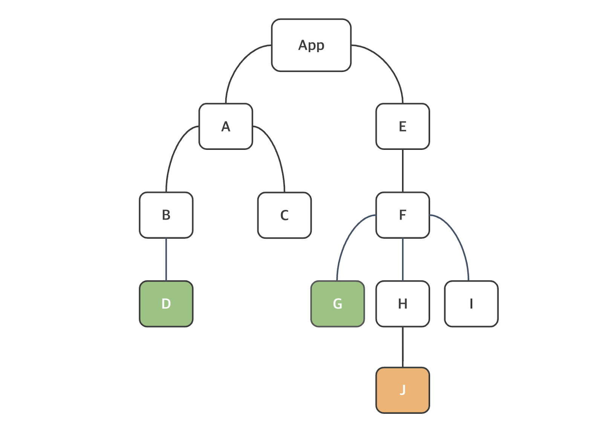
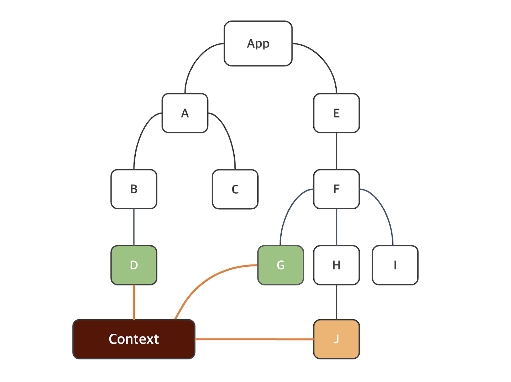

# 📂 03.04 수업 내용  
# 📍 안내사항
## Review
- 객체 스프레드 연산자
    - 객체의 properties를 업데이트하거나 복사할 때 사용
```jsx
let user = { lastName: '김', firstName: '영', city: '부산' }

user['age'] = 20;

user = { ...user, school: '코리아아이티고등학교' };
```
`...객체명/배열명`의 경우 기본적으로 내부 element의 자료형(배열의 경우)과 property(객체의경우)의 key-value pair를 고려할 필요가 있으며, 배열 자체 혹은 객체 자체가 아니라는 점을 명심해야 한다.

- 객체를 이용한 상태(state)
    - 상태의 initialValue를 객체 형태로 집어넣었을 경우 set객체명의 이용법은 이하와 같다.
```jsx
const [ name, setName ] = useState({firstName: '영', lastName: '김'});

setName({...name, firstName : '일'});

return <h1>Hello {name.firstName}</h1>  // Hello 일  return된다. {name['firstName']}형태도 가능하겠다.
```

## 🟣 상태 비저장 컴포넌트(Stateless Component)
props를 argument로 받아서 리액트 요소를 retrun하는 순수 JS 함수이다.
```jsx
function HeaderText(props) {
  return(
    <h1> {props.text} </h1>
  )
}
```
와 같이 작성되어있다면 상위 컴포넌트에서 `<HeaderText text='어쩌고 />`라고 작성되어있다고 추론할 수 있겠다.

이상의 예시는 Pure Component라고 한다. 순수 컴포넌트의 정의는 '동일한 입력값이 주어졌을 때 return되는 값이 일관되게 동일한 컴포넌트'이다. 이러한 순수 컴포넌트를 리액트에서는 성능 최적화를 하기 위해 React.memo()라는 것을 지원한다. 예시를 통해 확인하겠다.

```jsx
function HeaderText(props) {
  return(
    <h1> {props.text} </h1>
  )
}

export default memo(HeaderText);
```
와 같이 작성했을 경우 컴포넌트가 렌더링이 된 다음 메모이제이션(memoization)된다. 다음 렌더링에서 리액트는 props가 변경되지 않으면 메모된 결과를 렌더링한다. 즉 React.memo() 구문에서는 렌더링 조건을 사용자 정의하는 데 이용할 수 있는 arePropsEqual()과 같은 argument도 존재하긴 하지만 여기서는 다루지 않겠다. 다만 메모이제이션이라는 개념은 성능 최적화를 위해서 동일한 결과값이 존재한다면 고려해볼만한 요소라고 볼 수 있겠다.

## 🟣 조건부 렌더링
```jsx
export default function MyComponent2(props) {
  const isLoggedin = props.isLoggedin;

  if (isLoggedin) {
    return (<Login />)
  }
  return (<Logout />)
}
```
이상의 컴

## 🟣 React Hook
Hook 개념은 react 16.8부터 도입되었다. 훅을 이용하면 함수 컴포넌트에서 상태와 리액트의 다른 기능을 이용하는 것이 가능하다. 훅이 생기기 전에는 컴포넌트 로직이 필요한 경우 클래스 컴포넌트를 써야 했었다.
- 리액트를 사용할것이라면 웬만하면 최신이 도입되어있기 때문에 우리나라에서는 고려 사항이 안되는 편이다.

###  Hook 사용에서의 중요 규칙
1. 항상 리액트 함수 컴포넌트의 최상위 수준에서 Hook을 호출해야 한다. 
    - 첫번째 { } 내에서 호출
2. 조건문, 반복문, 중첩 함수 내에서 훅을 호출해서는 안된다.
3. 훅 이름은 use로 시작하며, 그 뒤에 훅을 이용하는 목적이 따라온다. 즉 useState라면 상태를 다루는 hook임을 명시했다고 볼 수 있다.

### Counter.jsx
```jsx
import {useState} from 'react';

export default function Counter() {
  // 초기값이 0인 count 상태 선언 및 초기화
  const [count , setCount] = useState(0);

  return (
    <div>
      <p>Counter = {count}</p>
      <button onClick={() => setCount(count + 1)}>
        Increment
      </button>
    </div>
  );
}
```
- 상태를 선언하는 데 사용되는 useState 함수를 활용하여 버튼을 누를 때 마다 count가 1씩 증가하는 예제를 작성하였다.

1. 리액트에서의 이벤트명은 카멜케이스(onClick)로 작성한다. html 상에서는 onclick이었다.
    - 별개의 이벤트명이기 때문에 자동완성을 했을 경우 JS 변수를 불러올 수 있는 { } 가 생성되는 것을 확인할 수 있다.
2. `onClick={() => setCount(count + 1)}`에 주목해야 한다. 왜 `onClick={setCount(count + 1)}`이 아닌가?
    - '함수'가 이벤트핸들러(onClick)에 전달되어야 하며, 사용자가 버튼을 클릭할 때만 리액트가 함수를 호출해야 한다. 이상의 예제에서는 function 키워드로 함수를 정의한것이 아니라 arrow function을 통해서 익명함수로 작성하였다. 이벤트 핸들러 안에서 함수를 '호출'하게 되면 컴포넌트가 렌더링될 때 함수가 호출되어 무한 루프가 발생하게 된다.
    ```jsx
    <button onClick={() => setCount(count + 1)}>  // 함수가 버튼을 눌렀을 떄 호출 됨

    <button onClick={setCount(count + 1)}> 
    // 함수가 렌더링 될때 호출되어 결과값이 바뀜 -> 상태가 바뀌었기 때문에 리렌더링 -> 함수가 호출되어 결과값이 바뀜 -> 리렌더링 : 무한루프
    ```
    - 그런데 상태의 업데이트는 비동기적이므로 새 상태 값이 현재 상태 값에 달라질 수 있다. 그래서 최신값을 확보한다는 것을 명심하기 위해서는
    `<button onClick={() => setCount(preValue => preValue + 1)}>`로 작성해야한다.

### 일괄처리(Batching)
- counter2.jsx

- React 버전 18 이후에서는 일괄처리가 버튼 클릭 같은 브라우저 이벤트 중 일부에서만 가능했다. 즉, 위의 코드에서 setCount1()이 호출되는 시점에 count1의 상태가 변경되었기 때문에 기존에 알던 state 정의에서 재렌더링이 일어나야 하지만, onClick 이벤트 중이기 때문에 재렌더링이 일어나지 않았고, setCount2()까지 호출되고 나서야 전체 컴포넌트가 재렌더링 되었다고 해석할 수 있다.

- React 버전 18 이후부터는 모든 상태 업데이트가 일괄 처리된다. 그래서 일괄 처리를 하지 않고싶은 경우에만 커스텀해야하는데 flushSync API라는 것을 추가로 사용해야 하는데, 이를 이용할 경우 다음 상태를 업데이트하기 전에 일부 상태하려는 경우가 있을 수 있는데, 보통은 브라우저 API와 같은 서드 파티 코드를 합칠 때 유용하게 사용된다. -> 그런데 리액트앱 전체 성능에 영향을 줄 수 있으므로 필요한 경우에만 사용해야 해서 지금은 다루지 않겠다.

### useEffect
- 리액트 함수 컴포넌트에서 보조 작업(side-effect)을 수행하는 데 이용할 수 있다. 주로 사용하는 것은 fetch 요청이다.
- 형식 : `useEffect(callback, [dependencies])`
- 첫번째 argument인 callback 함수는 보조 작업 로직(예를 들어 fetch해서 외부 api를 가지고 오는 등)이 포함되어 있으며, [dependencies]는 의존성을 포함하는 배열로 optional이다.

```jsx
import { useEffect, useState} from 'react';

export default function Counter3() {
  const [count , setCount] = useState(0);

  useEffect(() => console.log('Hello from useEffect'));

  return (
    <div>
      <p>Counter = {count}</p>
      <button onClick={() => setCount(preValue => preValue + 1)}>
        Increment
      </button>
    </div>
  );
}
```
- `useEffect(() => console.log('Hello from useEffect))` : 두 번째 argument가 없는 상태이다. 그러면 따로 dependencies가 없는 상태이기 때문에 useEffect()를 안썼을 때와 동일하다. 즉 재렌더링이 일어날 때마다 첫번째 argument인 callback 함수가 호출된다. 개발자 도구의 console에서 확인할 수 있다.

- useEffect에는 콜백함수가 _모든 렌더링에서 실행되는 것이 아니라 선택적으로 실행할 수 있는_ 의존성 배열을 두번째 argument로 갖는다. 이하의 예시는 count 상태값이 변경되면, 즉 이전 값과 현재 값이 달라지면 useEffect가 호출될 수 있도록 작성한다. 그리고 두번째 argument는 배열이기 때문에 내부에 여러 상태를 정의하는 것도 가능하다. 그 경우 상태 값 중 하나라도 변경되면 useEffect 훅이 호출된다.

- `useEffect(() => console.log('Hello from useEffect'), [count]);` : count 상태가 바뀔 때마다 useEffect() 내의 callback 함수가 호출된다.
```jsx
import { useEffect, useState} from 'react';

export default function Counter4() {
  const [count1 , setCount1] = useState(0);
  const [count2 , setCount2] = useState(0);

  useEffect(() => console.log('Count1 상태변경이 되었습니다.'), [count1]);

  return (
    <div>
      <p>Count : {count1} | {count2}</p>
      <button onClick={() => setCount1(preValue => preValue + 1)}>
        count1 증가
      </button>
      <br />
      <br />
      <button onClick={() => setCount2(preValue => preValue + 1)}>
        count2 증가
      </button>
    </div>
  );
}
```
- count1과 count2로 나누어서 확인해보았다. `useEffect(() => console.log('Count1 상태변경이 되었습니다.'), [count1]);`로 인해서 count1 값이 바뀔때만 콜백함수가 호출된다.

- `useEffect(() => console.log('첫번째 렌더링시에만 콜백함수가 호출된다.'), []);`

### useRef
- DOM 노드에 접근하는 데 이용할 수 있는 _변경 가능한 ref 객체_ 를 retrun한다.
- 형식 : `const ref = useRef(initialValue)`
- return된 ref 객체에는 전달된 argument로 초기화된 현재 속성(current initialValue)이 있다. 이하에서는 inputRef라는 ref 객체를 생성한 다음, null로 초기화를 해두고 JSX 요소의 ref 속성을 이용하여, input 요소의 focus 함수를 실행할 것이다. 

```jsx
import { useRef } from "react";
import './App.css';

export default function App() {
  const inputRef = useRef(null);

  return(
    <>
      <input type="text" ref={inputRef} />
      <button onClick={() => inputRef.current.focus()}>Focus input</button>
    </>
  );
}
```
- input 태그에 딸려있는 속성에 주목

### custom Hook
리액트에서 사용자 정의 훅 함수를 정의하는 것이 가능하다. Hook의 조건에서처럼 use로 시작해야하며, 기본적으로는 JavaScript 함수이다. 그리고 함수 내에서 다른 함수를 호출할 수 있듯 hook 내에서 다른 hook을 호출하는 것도 가능하다. 이를 이용하면 컴포넌트의 복잡성을 줄이고 재사용성이 늘어날 수 있다.

title 태그의 값을 바꾸는 DOM 조작 관련 훅 함수를 생성 (useTitle)
```js
import { useEffect } from "react";

function useTitle(title) {
  useEffect(() => {
    document.title = title;
  }, [title]);
}
export default useTitle;
```
- 호출시에 받은 매개변수 title이 변경 될때마다 해당 index.html의 title 태그의 값을 재대입한다.
- useTitle이라는 사용자 정의 hook 내부에서 useEffect()라는 정의된 hook을 호출하였다.

```jsx
import {useState} from 'react';
import useTitle from './useTitle';

export default function Counter5() {
  const [count , setCount] = useState(0);
  useTitle(`당신은 ${count} 번 클릭했습니다.`);

  return (
    <div>
      <p>Counter = {count}</p>
      <button onClick={() => setCount(preValue => preValue + 1)}>
        Increment
      </button>
    </div>
  );
}
```
- 정의는 .js파일에 하고, 호출은 Counter5.jsx에서 했다. useTitle은 title이라는 매개변수를 가지기 때문에 이를 템플릿 리터럴을 통해서 argument로 보냈다.
```jsx
const title = `당신은 ${count} 번 클릭했습니다.`;
useTitle(title);
```
로 clean code 작성하여도 괜찮다.

## 🟣 Context API 
- 원리는 중요하지만 아마 프로젝트 때는 Zustand를 쓰게 될 것이다.
- 컴포넌트의 구조는 트리 구조를 따르고 있고, 상위 컴포넌트에서 하위 컴포넌트로 props를 전달해주는 형태를 가지고 있다. 이를 미리 알고 있는 상황에서 가정할 수 있는 것은 트리 구조가 4단으로 이루어져 있는데, 가장 상위에서 props를 전달하고, 가장 하위에서 이를 return에서 풀어준다고 했을 때, 2, 3단의 컴포넌트들은 props를 전달 받아야한다. 이를 해결하기 위한 방식이 Context API로, 전역 데이터를 이용하는 경우 도입하는 방식이다.




```js
// createContext.js
import { createContext } from "react"

const AuthContext = createContext('');

export default AuthContext;
```
```jsx
// App.jsx
import './App.css'
import MyComponent from './MyComponent';
import AuthContext from './createContext';

export default function App() {
  // props drilling 말고 전달할 변수 하나 선언
  const username = 'Kim0';

  return (
    <AuthContext.Provider value={username}>
      <MyComponent />
    </AuthContext.Provider>
  );
}

```

```jsx
// MyComponent.jsx
import { useContext } from "react";
import AuthContext from "./createContext";

export default function MyComponent() {
  const authContext = useContext(AuthContext);
  return(
    <p>
      welcome {authContext}
    </p>
  );
}
```
- 이상은 

```jsx
import './App.css'
import MyComponent from './MyComponent';

export default function App() {
  // props drilling 말고 전달할 변수 하나 선언
  const username = 'Kim0';

  return (
      <MyComponent username={username} />
  );
}
```

```jsx
import Hello from "./Hello";

export default function MyComponent(props) {
  return(
    <>
      {props.username} 님, <br />
      <Hello username={props.username} />
    </>
  );
}
```
```jsx
export default function Hello({username}) {
  return (
    <>
      안녕하세요, {username}
    </>
  );
}
```

- Context API 적용한 예시
```jsx
import './App.css'
import AuthContext from './createContext';
import MyComponent from './MyComponent';

export default function App() {
  const username = 'Kim0';

  return (
    <>
      <AuthContext.Provider value={username}>
        <MyComponent />
      </AuthContext.Provider>
    </>
  );
}
```

```jsx
import Hello from "./Hello";

export default function MyComponent() {
  return(
    <>
      <Hello />
    </>
  );
}
```

```jsx
import { useContext } from "react";
import AuthContext from "./createContext";

export default function Hello() {
  const username = useContext(AuthContext);
  return (
    <>
      안녕하세요, {username}
    </>
  );
}
```

## 🟣 React list
```jsx
export default function MyList() {
  const data = [1,2,3,4,5];
  return (
    <ul>
      {
        data.map((elem, index) =>
          <li key={index}>List Item : {elem*2}</li>
        )
      }
    </ul>
  );
}
```

# 🚨발생한 문제


# 📖 복습 & 확인
✔️ 개별 공부 : Context API (Zustand)
💡📌📍🚩🚨⚠️